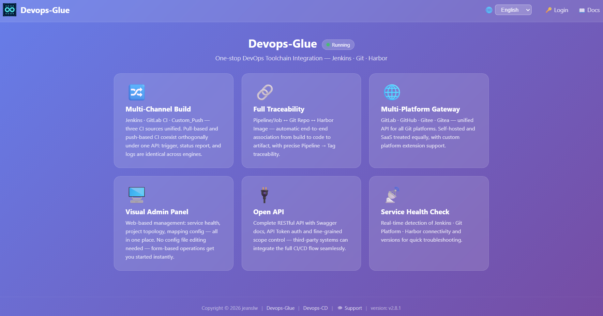
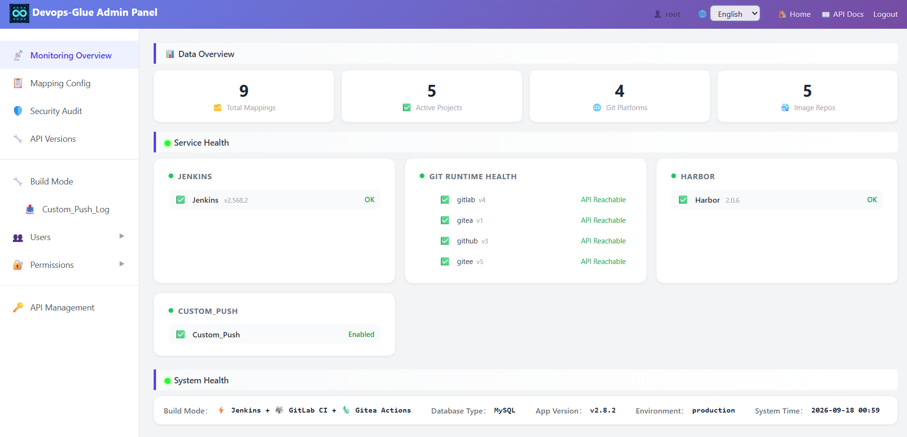

# Devops-Glue API v2.7.0
DevOps-Glue API is a Slim 4–based integration platform designed to enhance DevOps toolchains for small teams. It provides a unified view, RBAC, and RESTful APIs, with support for multiple mainstream Git platforms and CI-agnostic integration.

<p align="center">
  <strong>🔧 Lightweight CI Management Service | Swiss Army Knife for Small Teams</strong><br/>
  Built with PHP + Slim4 — A CI & DevOps data aggregation platform designed for small teams
</p>

<p align="center">
  <a href="https://github.com/jeanslw/Devops_CD"></a>
  <a href="https://github.com/jeanslw/devops-glue/releases/tag/v2.7.0"></a>
  <a href="https://github.com/jeanslw/devops-glue"></a>
  <a href="https://github.com/jeanslw/devops-glue/blob/main/LICENSE">
  <a href="https://www.php.net">
  <a href="https://www.slimframework.com">
</p>

> 🔗 **This is a CI enhancement component** | Full system requires the CD deployment service → [Devops_CD](https://github.com/jeanslw/Devops_CD)


##  Why Devops-Glue + CD?

> 🔧 **A Unified Management Console for Jenkins & GitLab CI & Custom CI**
> ✅ Make your distributed Jenkins instances, GitLab CI projects, and Custom CI manageable, observable, and auditable

- 🔍 **Unified Build View**: Cross-engine search and aggregation of all build history — no more platform switching
- 📝 **Custom_Push**: Orthogonal push-based CI — pull and push coexist simultaneously. [\[**Use case**\]](docs/ADMIN_MANUAL.md#12-configure-build-mode)
- 🔐 **Fine-grained RBAC**: More flexible access control than native plugins, tailored for team-scale organizations
- 🚀 **Non-invasive Integration**: API-only connection with zero changes to existing CI configs — onboard in under 5 minutes

> **[Chinese](README_ZH-CN.md)**




## Features

- **Custom Push CI (Custom_Push)** — User CI pushes build status, log URL, image tags; Devops-Glue only stores metadata without participating in builds. Orthogonal to pull-based CI, can be enabled simultaneously
- **Multi-Build Pipeline** — Jenkins + GitLab CI + Custom_Push, switch or coexist, unified API
- **Multi-Platform Git** — GitLab · GitHub · Gitee · Gitea, self-hosted or SaaS
- **Full-Chain Mapping** — Job ↔ Git repo ↔ Harbor image, build→code→artifact auto-association
- **Security Scan Audit** — SAST, secret scanning, dependency vulns written back via Commit Status
- **Role-Based Access (Data-Driven RBAC)** — custom multi-level roles with per-role permissions. Only `super_admin` is a built-in system role; every other role and its permission set is user-defined in the admin UI. Permission keys and implied rules are stored in DB; no code change required when new menus/modules are added.
- **i18n** — Chinese / English bilingual interface, `?lang=` instant switching via `symfony/translation`
- **Admin Dashboard** — service monitoring, mapping config, security scan, user management
- **Zero-Config Startup** — SQLite by default, MySQL / MariaDB with one-click switch
- 

##  Architecture Overview
<details>
<summary>Click to expand</summary>

```
┌─────────────────────────────────────────────────────────────┐
│                      CODE PUSH                              │
│  GitLab / Gitee / GitHub / Gitea  →  Webhook Trigger        │
└──────────────────────────┬──────────────────────────────────┘
                           ↓
┌─────────────────────────────────────────────────────────────┐
│                     CI LAYER: Devops-Glue API (PHP)         │
│                                                             │
│  ┌──────────────┐  ┌──────────────┐   ┌──────────────┐      │
│  │   Jenkins    │  │  GitLab CI   │   │   Custom CI  │      │
│  │ BuildProvider│  │ BuildProvider│   │ BuildProvider│      │
│  └──────┬───────┘  └──────┬───────┘   └──────┬───────┘      │
│         └─────────────────┼──────────────────┘              │
│                           ↓                                 │
│              Build → Docker Image → Harbor Registry         │
│                           ↓                                 │
│              scan-sync → ci_pipeline_tags                   │
└──────────────────────────┬──────────────────────────────────┘
                           ↓
┌─────────────────────────────────────────────────────────────┐
│                     CD LAYER: cd_service (Python)           │
│                                                             │
│   Select Project + Tag  ──→  Deploy Execution               │
│                                                             │
│   ┌──────────────┐  ┌──────────────┐  ┌──────────────┐      │
│   │  SSH Script  │  │Docker Compose│  │  Kubernetes  │      │
│   │  Ansible     │  │  SFTP + up   │  │ kubectl/Helm │      │
│   │              │  │              │  │ ArgoCD/FluxCD│      │
│   └──────────────┘  └──────────────┘  └──────────────┘      │
│                           ↓                                 │
│              cd_deploy_logs (Deployment Records)            │
│                           ↓                                 │
│              DingTalk / WeCom Webhook Notifications         │
└─────────────────────────────────────────────────────────────┘
```
</details>

## Quick Start
<details>
<summary>Click to expand</summary>

```bash
# 1. Clone
git clone https://github.com/jeanslw/Devops-Glue.git
cd Devops-Glue

# 2. Install dependencies
composer install

# 3. Configure environment
cp config/.env.example config/.env
# Edit config/.env with your actual credentials

# 4. Start (PHP built-in server or Docker)
php -S 0.0.0.0:8080 -t public/
# OR
docker compose up -d --build

# 5. Verify
curl http://localhost:8080/api/health
```

Visit `http://localhost:8080/admin` for the admin panel (credentials in `.env`).

Visit `http://localhost:8080/api/docs` for interactive API docs (Swagger UI).
</details>

## Requirements

| Component | Version |
|---|---|
| PHP | 8.1+ |
| Database | SQLite (default) / MySQL 8.0+ / MariaDB 10.4+ |
| Jenkins | v2.60+ |
| GitLab | v9.0+ (API v4) |
| Harbor | v1.10.1 / v2.x |

> **Harbor robot account:** calling the REST API via a robot account requires Harbor **v2.2.0+** (secret-based). On v1.x / v2.0.x / v2.1.x the robot token is a JWT (Docker/Helm CLI only) — use a normal account instead. See [docs/ADMIN_MANUAL.md](docs/ADMIN_MANUAL.md#11-connect-harbor).

See [docs/ADMIN_MANUAL.md](docs/ADMIN_MANUAL.md) for full environment variable reference and CORS configuration.

## Documentation

| Document | Language | Description |
|----------|----------|-------------|
| [API Reference](docs/API_Documents.md) | EN | API endpoints, request/response formats, quick tests |
| [ARCHITECTURE](docs/ARCHITECTURE.md) | EN | Overall data flow, component relationships, deployment pattern matrix|
| [Admin Manual](docs/ADMIN_MANUAL.md) | EN | Environment variables, mapping config, custom Git platform |
| [Single Sign-On](docs/Single-Sign-On.md) | EN | OAuth2 / OIDC SSO for Grafana / Jenkins / Harbor / GitLab |
| [Technical Guide](docs/Technical-Guide.md) | EN | Architecture, DB design, data flows, troubleshooting |
| [Integrated Service Version Compatibility](docs/Integrated-Service-Version-Compatibility.md) | EN | Jenkins / GitLab / Gitea / Harbor version support and boundaries |
| [FAQ](docs/FAQ.md) | EN | Common issues and troubleshooting |
| [Changelog](docs/CHANGELOG.md) | — | Release notes |

## Related Projects

- **Devops-CD** — Continuous Deployment system that can be used alongside this system:  
  https://github.com/jeanslw/Devops_CD

## Project Structure

```
config/         # Server config (.env, DI container, routes, settings)
database/       # MySQL & SQLite init scripts
docker-compose.yml # Docker Compose (PHP + MySQL 8.4)
public/         # Web root (index.php, static assets)
src/            # Controllers & Services
templates/      # HTML templates (admin, swagger, openapi)
docs/           # Documentation
```

## License

MIT

## Contact

- Issues & PRs: [GitHub Issues](https://github.com/jeanslw/Devops-Glue/issues)
- Email: jeanslw@qq.com
