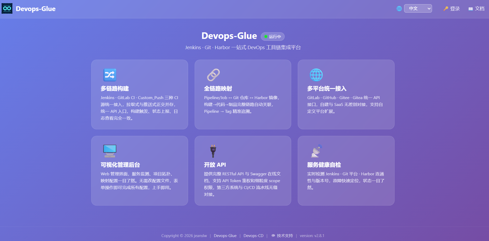
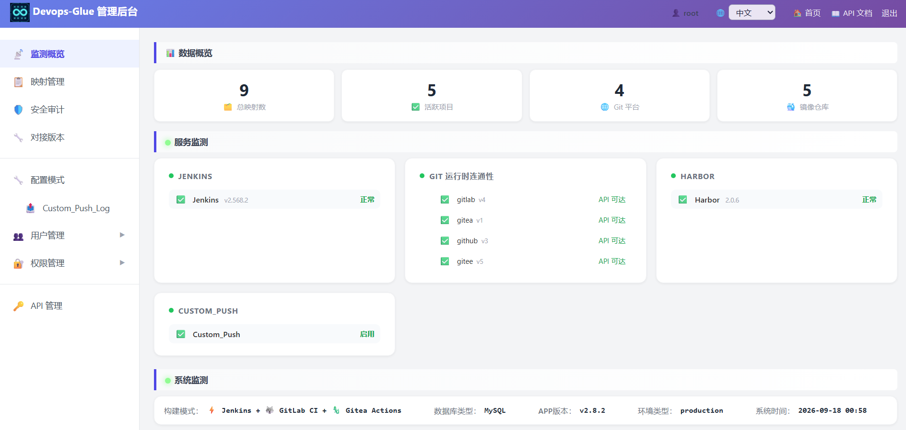

# Devops-Glue API v2.6
Devops-Glue API 是基于 Slim4 为小团队打造的 DevOps 工具链增强集成平台。支持统一视图、RBAC、API，主流多Git平台，支持任何CI。

<p align="center">
  <strong>🔧 轻量级 CI 管理服务 | 小团队的瑞士军刀</strong><br/>
  PHP + Slim4 构建，专为小团队设计的持续集成与 DevOps 数据聚合平台
</p>

<p align="center">
  <a href="https://gitee.com/jeanslw/devops_cd"></a>
  
  
  
</p>

> 🔗 **本项目为CI增强组件** | 完整系统需配套 CD 部署服务 → [Devops_CD](https://gitee.com/jeanslw/devops_cd)

## 为什么选择 Devops-Glue + CD？

> 🔧 **给 Jenkins / GitLab CI / Custom CI 加一层统一管理控制台**
> ✅ **分散不同的CI系统**： Jenkins 、 GitLab CI 项目、Custom CI 变得可管理、可视化、可审计

- 🔍 **统一构建视图**：跨引擎聚合检索所有构建历史，告别多平台切换
- 📝 **Custom_Push功能**：新增的Custom_Push功能，正交设计让拉取式、推送式同时兼得 [应用案例](docs/管理员配置手册.md#12-配置构建模式)
- 🔐 **细粒度 RBAC**：比原生插件更灵活的权限管控，精准匹配中小团队组织架构
- 🚀 **非侵入式接入**：仅通过 API 对接，零修改现有 CI 配置，5 分钟完成纳管

> **[英文版](README.md)**




## 功能特性

- **自定义推送式 CI（Custom_Push）** — 用户 CI 推送构建状态、日志地址、镜像 tag，Devops-Glue 仅存元数据，与 pull-based CI 正交可同时启用
- **多构建通道** — Jenkins + GitLab CI + Custom_Push，随意切换或并存，统一 API
- **多平台 Git** — GitLab · GitHub · Gitee · Gitea，自托管或 SaaS 均可
- **全链路映射** — Job ↔ Git 仓库 ↔ Harbor 镜像，构建→代码→产物自动关联
- **安全扫描审计** — SAST、密钥扫描、依赖漏洞检测，通过 Commit Status 回写
- **角色权限分级（数据驱动 RBAC）** — `super_admin` > `admin` > `deployer` > `viewer`，权限键与隐含规则全部存数据库。
- **国际化** — 中/英文双语界面，`?lang=` 即时切换，基于 `symfony/translation`
- **管理面板** — 服务监控、映射配置、安全扫描、用户管理
- **零配置启动** — 默认 SQLite，一键切换 MySQL / MariaDB

## 架构全景图
<details>
<summary>点击展开</summary>

```
┌─────────────────────────────────────────────────────────────┐
│                        CODE PUSH                            │
│  GitLab / Gitee / GitHub / Gitea  →  Webhook Trigger        │
└──────────────────────────┬──────────────────────────────────┘
                           ↓
┌─────────────────────────────────────────────────────────────┐
│                     CI 层：Devops-Glue API (PHP)            │
│                                                             │
│  ┌──────────────┐  ┌──────────────┐   ┌──────────────┐      │
│  │   Jenkins    │  │  GitLab CI   │   │   自定义 CI  │      │
│  │ BuildProvider│  │ BuildProvider│   │ BuildProvider│      │
│  └──────┬───────┘  └──────┬───────┘   └──────┬───────┘      │
│         └─────────────────┼──────────────────┘              │
│                           ↓                                 │
│              Build → Docker Image → Harbor Registry         │
│                           ↓                                 │
│              scan-sync → ci_pipeline_tags                   │
└──────────────────────────┬──────────────────────────────────┘
                           ↓
┌─────────────────────────────────────────────────────────────┐
│                     CD 层：cd_service (Python)              │
│                                                             │
│   选择 Project + Tag  ──→  部署执行                         │
│                                                             │
│   ┌──────────────┐  ┌──────────────┐  ┌──────────────┐      │
│   │  SSH 脚本    │  │Docker Compose│  │  Kubernetes  │      │
│   │  Ansible     │  │  SFTP + up   │  │ kubectl/Helm │      │
│   │              │  │              │  │ ArgoCD/FluxCD│      │
│   └──────────────┘  └──────────────┘  └──────────────┘      │
│                           ↓                                 │
│              cd_deploy_logs (部署记录)                      │
│                           ↓                                 │
│              钉钉 / 企业微信 Webhook 通知                   │
└─────────────────────────────────────────────────────────────┘
```
</details>

## 快速开始
<details>
<summary>点击展开</summary>

```bash
# 1. 克隆
git clone https://github.com/jeanslw/Devops-Glue.git
cd Devops-Glue

# 2. 安装依赖
composer install

# 3. 配置环境
cp config/.env.example config/.env
# 编辑 config/.env 填入实际凭证

# 4. 启动（PHP 内置服务器或 Docker）
php -S 0.0.0.0:8080 -t public/
# 或
cd docker-compose && docker compose up -d --build

# 5. 验证
curl http://localhost:8080/api/health
```

访问 `http://localhost:8080/admin` 进入管理面板（账号密码见 `.env`）。

访问 `http://localhost:8080/api/docs` 查看交互式 API 文档（Swagger UI）。
</details>

## 运行环境

| 组件 | 版本要求 |
|---|---|
| PHP | 8.1+ |
| 数据库 | SQLite（默认）/ MySQL 8.0+ / MariaDB 10.4+ |
| Jenkins | v2.60+ |
| GitLab | v9.0+（API v4） |
| Harbor | v1.10.1 / v2.x |

完整环境变量参考和 CORS 配置请见 [docs/管理员配置手册.md](docs/管理员配置手册.md)。

## 文档

| 文档 | 语言 | 说明 |
|------|------|------|
| [API 参考](docs/API_文档.md) | 中文 | API 接口、请求/响应格式、快速测试 |
| [架构全景图](docs/架构全景图.md) | 中文 | 整体数据流、组件关系、部署模式矩阵|
| [管理员手册](docs/管理员配置手册.md) | 中文 | 环境变量、映射配置、自定义 Git 平台 |
| [技术文档](docs/技术文档.md) | 中文 | 架构设计、数据库设计、数据流程、故障排查（中文） |
| [常见问题](docs/常见问题.md) | 中文 | 常见问题与排查指南（中文） |
| [更新日志](docs/更新日志.md) | 中文 | 版本发布记录 |

## 相关项目

- **Devops-CD** — 持续部署系统，依赖于本系统。
  https://gitee.com/jeanslw/devops_cd

## 项目结构

```
config/         # 服务端配置（.env、DI 容器、路由、设置）
database/       # MySQL 和 SQLite 初始化脚本
docker-compose/ # Docker Compose（PHP + MySQL 8.4）
public/         # Web 根目录（index.php、静态资源）
src/            # 控制器与服务层
templates/      # HTML 模板（admin、swagger、openapi）
docs/           # 文档
```

## 许可证

MIT

## 联系方式

- 问题与 PR：[GitHub Issues](https://github.com/jeanslw/Devops-Glue/issues)
- 邮箱：jeanslw@qq.com
